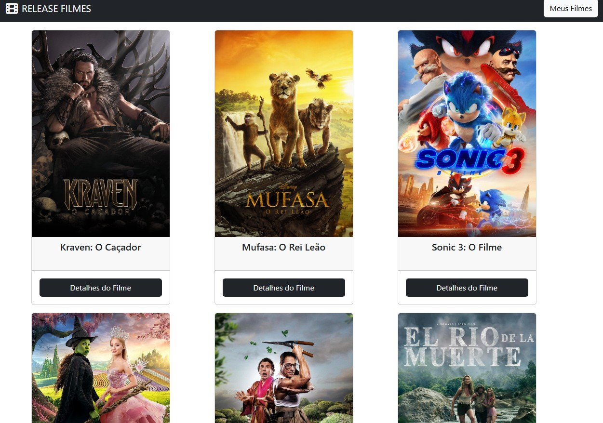
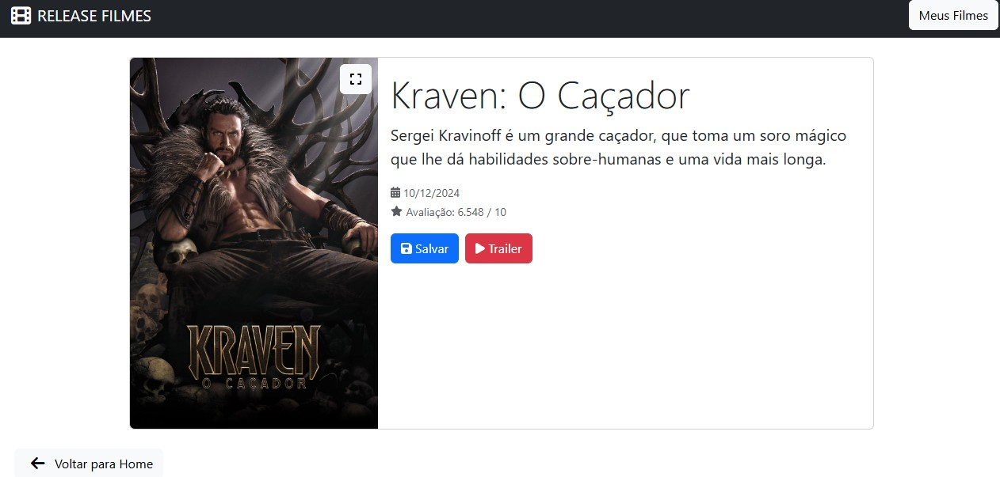
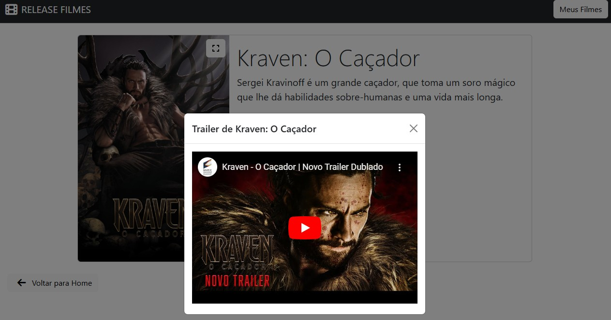
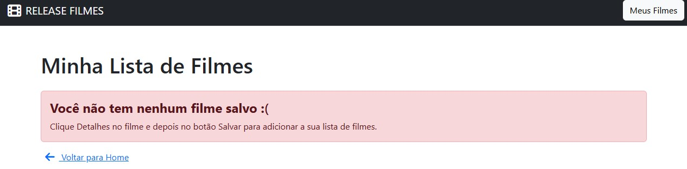
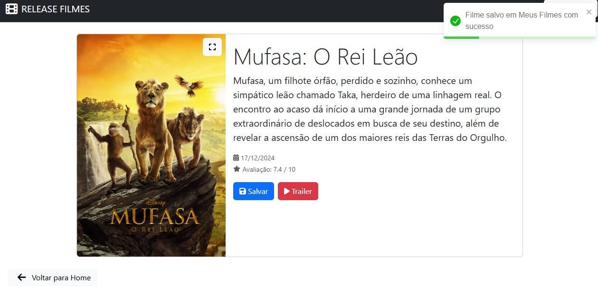

# Release Filmes








Release Filmes é uma aplicação web desenvolvida em React que consome uma API externa para fornecer informações sobre filmes. A aplicação permite aos usuários realizar operações de criação, leitura, atualização e exclusão (CRUD) de registros de filmes, oferecendo uma interface intuitiva e responsiva.

## ✨ Funcionalidades

- **Listagem de Filmes:** Exibe uma lista de filmes obtidos da API externa.
- **Detalhes do Filme:** Permite visualizar informações detalhadas de um filme selecionado.
- **Adicionar Novo Filme:** Possibilita a inclusão de novos filmes ao catálogo.
- **Editar Filme:** Facilita a atualização das informações de filmes existentes.
- **Excluir Filme:** Oferece a opção de remover filmes do catálogo.

## 🛠️ Tecnologias Utilizadas

- **React:** Biblioteca JavaScript para construção de interfaces de usuário.
- **API Externa de Filmes:** Fonte de dados para informações sobre filmes.
- **Axios:** Biblioteca para realizar requisições HTTP.
- **React Router:** Gerenciamento de rotas na aplicação.
- **Bootstrap:** Framework CSS para estilização e responsividade.

## 🚀 Instalação

1. Clone este repositório para sua máquina local:

   ```bash
   git clone https://github.com/vbeal/release-filmes.git
   ```

---

**Autor:** [Victor Beal]  
**Repositório:** [Repositório do Projeto no GitHub](https://github.com/vbeal?tab=repositories)  
**LinkedIn:** [Meu LinkedIn](https://www.linkedin.com/in/victorbeal)
